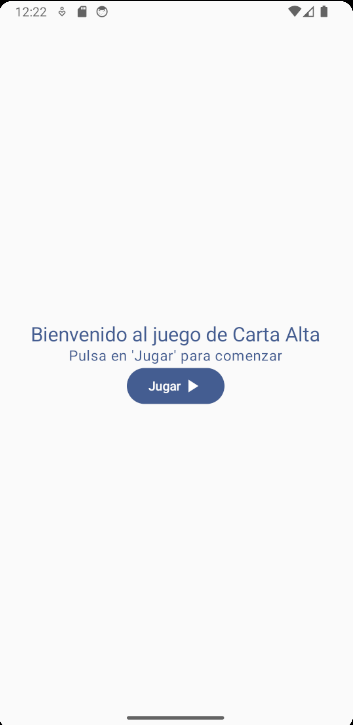
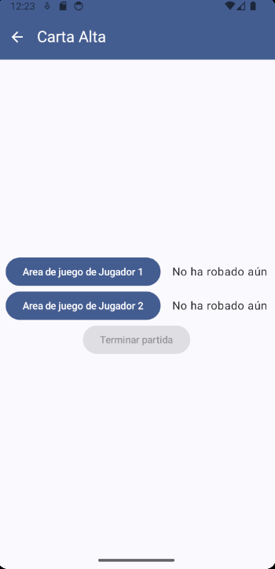
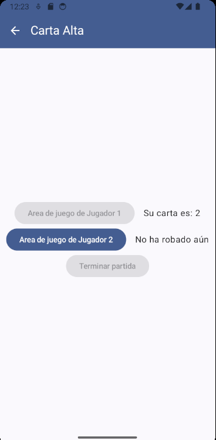
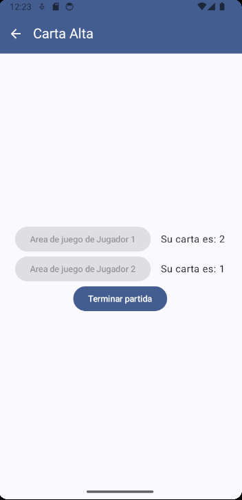
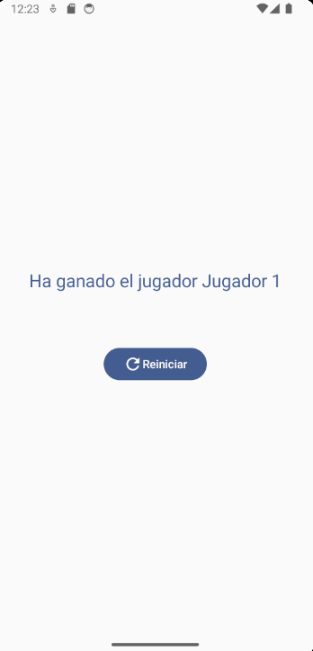
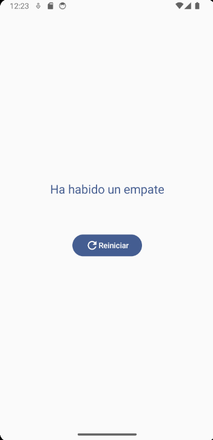

# App de Carta Alta (Enunciado)

Elaborar una app para jugar a la carta alta (versión sencilla). Leer bien todo el enunciado hasta el final antes de comenzar, una vez hecho esto, partir de un proyecto vacío o un proyecto con una ``activity`` sencilla de Compose.

La aplicación debe constar de 3 pantallas:

 - Una pantalla de **Home**:

    

    La pantalla de **Home** simplemente debe contener esos tres elementos tal y como aparecen en la imagen. 

    Para conseguir un resultado idéntico se puede usar la tipografía ``titleLarge`` por defecto para el título y la tipografía ``bodyLarge`` para el subtítulo. El color de los textos es ``primary``.

    Es importante intentar mantener las ``Strings`` en recursos para no hardcodear.

 - Una pantalla de **Game**:

    

    En la pantalla de juego debemos añadir una barra superior con el título correspondiente y un botón para navegar de vuelta a la pantalla de **Home**. Los colores de la barra son primary para el fondo y ``onPrimary`` para todo lo demás.

    En el contenido de la pantalla debemos tener 3 botones. Dos para que cada jugador robe su carta y otro para llevarnos a la pantalla de **GameOver** tras jugar. 

     

    Los botones de cada jugador solo deben poder usarse una vez por partida, de forma que deben desactivarse tras la tirada. A la derecha de cada botón debe aparecer el número de la carta que ha sacado el jugador (un número entre 1 y 13 aleatorio). Pero antes de jugar debe indicarse que todavía no ha robado carta, tal y como se muestra en las imágenes. 

     

    Una vez ambos jugadores roben su carta, debe activarse el tercer botón que nos llevará a la pantalla de **GameOver** pasando el ganador o indicando si han empatado en caso de que ambos tengan el mismo valor en la carta que han robado.

  - Una pantalla de **GameOver**:

    

    En esta pantalla tan solo tendremos el resultado de quién ha ganado o si ha ocurrido un empate, dependiendo de lo que haya ocurrido en la pantalla anterior.

    Además tendremos un botón para reiniciar el juego que nos llevará a la pantalla de Home y eliminará la posibilidad de volver a esta pantalla tras pulsarlo a través de los gestos o el botón de 'atrás' del teléfono.

    Para un resultado óptimo, de nuevo el texto debe tener una tipografía por defecto ``titleLarge`` y un color ``primary``. El ``Spacer`` que separa el texto del botón es de ``64dp``.

    En caso de empate:

     

## A tener en cuenta

- La aplicación debe gestionar la navegación enviando lambdas desde el ``NavHost`` y no propagando el ``navController``, ya que cada pantalla solo puede ir a 1 o 2 pantallas como máximo.

- Desde la pantalla de **Game** a la de **GameOver** es necesario enviar un argumento al navegar con la información necesaria para saber quién ha ganado.

- El estado de la pantalla de juego debe de controlarse de forma aislada, es decir, deberíamos gestionar todos los eventos desde un ``ViewModel`` y definir muy bien el model de la UI para esta pantalla. Es la única de las 3 que lo necesita. El ejercicio puede resolverse sin hacer esto pero tendrá penalización en la calificación ya que el correcto uso de la arquitectura **MVVM** es una parte de la nota.

## Posible rúbrica de ejemplo para calificar - no definitiva

| **Criterio**                | **Descripción**                                                                                                                                                                | **Peso** | **Escala de Puntuación**                                                                                                                                                                                |
|-----------------------------|--------------------------------------------------------------------------------------------------------------------------------------------------------------------------------|----------|---------------------------------------------------------------------------------------------------------------------------------------------------------------------------------------------------------|
| **Funcionamiento Correcto** | Verifica que la app realiza correctamente las funcionalidades: navegación entre pantallas, desactivación de botones, simulación del robo de cartas, cálculo del ganador y reinicio del juego.                       | **30%**  | - **0-5**: La app no funciona o es inestable. - **6-10**: Funcionalidades críticas fallan (ej. botones no responden, ganador no calculado). - **11-20**: Funciona con errores menores. - **21-30**: Funciona correctamente. |
| **Interfaz y UX**           | Evalúa si la interfaz es clara, atractiva, y si la experiencia de usuario es fluida e intuitiva (ej. botones bien posicionados, transiciones suaves entre pantallas, textos claros).                              | **20%**  | - **0-5**: Diseño confuso, mala UX. - **6-10**: Diseño funcional pero con problemas de usabilidad. - **11-20**: Diseño intuitivo, experiencia satisfactoria. - **21-30**: Diseño excelente y UX destacada.               |
| **Navegación**              | Analiza la correcta implementación de navegación entre pantallas. Penaliza si se propaga el `NavController` o si los parámetros no se envían correctamente a la pantalla de "Game Over".                          | **25%**  | - **0-5**: Navegación no funcional. - **6-10**: Navegación implementada con errores graves (propagación incorrecta de parámetros o `NavController`). - **11-20**: Navegación funcional con errores menores. - **21-25**: Navegación óptima. |
| **Manejo del Estado (MVVM)** | Evalúa la implementación de la gestión de estado en la app, específicamente que siga la arquitectura **MVVM** (Model-View-ViewModel). Penaliza el manejo incorrecto o si no se usa MVVM.                         | **25%**  | - **0-5**: Sin gestión de estado clara. - **6-10**: Estado gestionado sin MVVM. - **11-20**: Uso de MVVM con errores menores. - **21-25**: Uso correcto y eficiente de MVVM para el manejo del estado.                    |
